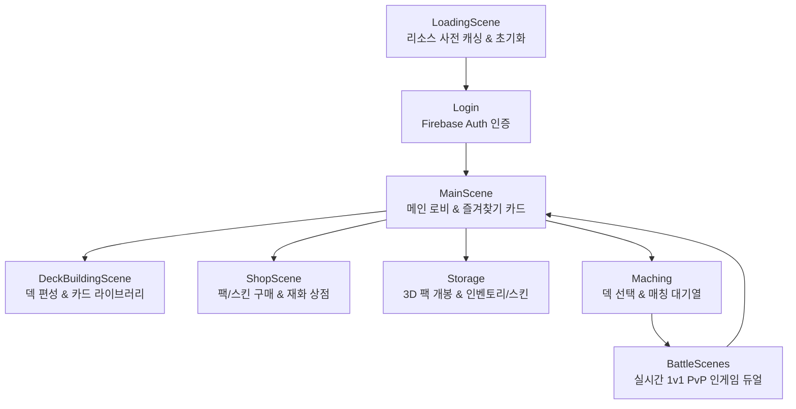
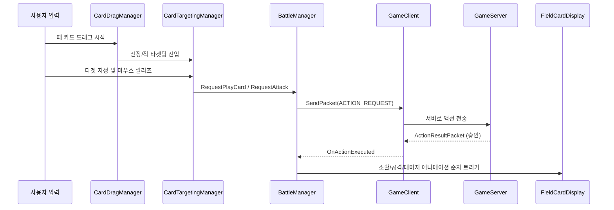
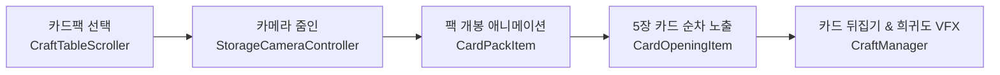

# 🎮 Stellar Duel 코드 아키텍처 & 사용법 가이드 (Code Architecture Guide)

이 문서는 **Stellar Duel** 클라이언트의 C# 스크립트 아키텍처, 핵심 시스템별 기능, 데이터 흐름 및 사용법을 상세히 기술한 공식 개발 레퍼런스 문서입니다.

---

## 📌 목차 (Table of Contents)
1. [시스템 아키텍처 및 씬 흐름 개요](#1-시스템-아키텍처-및-씬-흐름-개요)
2. [코어 데이터 모델 및 스펙](#2-코어-데이터-모델-및-스펙)
3. [인게임 배틀 시스템 (Game / Battle)](#3-인게임-배틀-시스템-game--battle)
   - 3.1 배틀 매니저 및 네트워크 (`BattleManager`, `GameClient`)
   - 3.2 엔티티 및 보드 디스플레이 (`GameEntityManager`, `FieldCardDisplay`, `LeaderCardDisplay`)
   - 3.3 입력, 드래그 및 타겟팅 (`CardDragManager`, `CardTargetingManager`, `TargetingReticle`)
   - 3.4 공격 연출 및 카메라 (`EntityAttackManager`, `CameraShakeManager`, `ProjectileController`)
   - 3.5 배틀 UI 및 이모티콘 (`GameLogManager`, `EmotionManager`, `SideDeckUIManager`, `SurrenderManager`)
4. [덱 빌딩 시스템 (Deck Building)](#4-덱-빌딩-시스템-deck-building)
5. [매칭 및 로비 시스템 (Matchmaking & Lobby)](#5-매칭-및-로비-시스템-matchmaking--lobby)
6. [상점 시스템 (Shop)](#6-상점-시스템-shop)
7. [창고 및 3D 카드팩 개봉 시스템 (Storage & Pack Opening)](#7-창고-및-3d-카드팩-개봉-시스템-storage--pack-opening)
8. [계정 및 인증 시스템 (Authentication)](#8-계정-및-인증-시스템-authentication)
9. [공통 UI 및 로딩/리소스 유틸리티 (Common UI & Loading)](#9-공통-ui-및-로딩리소스-유틸리티-common-ui--loading)

---

## 1. 시스템 아키텍처 및 씬 흐름 개요

### 1.1 전체 씬 라이프사이클 흐름
Stellar Duel 클라이언트는 다음과 같은 씬 흐름으로 구동됩니다:

### 1.2 네트워크 및 백엔드 연동 구조
- **게임 서버 (`E:\Server\MyGameServer\MyGameServer`)**:
  - `GameClient.cs`를 통해 TCP/WebSocket 소켓 통신을 수행합니다.
  - 턴 개시, 멀리건, 소환 권한 검증, 타겟팅 공격 판정, 피해 계산, 승패 판정 등 인게임의 모든 권한(Server-Authoritative)을 가집니다.
- **Google Firebase**:
  - **Firebase Authentication**: `SinginManager.cs`를 통한 사용자 계정(UID) 식별.
  - **Firestore / Database**: 유저 재화, 소유 카드 목록, 저장된 덱 데이터(`DeckSaveManager_Firebase.cs`), 상점 판매 데이터 연동.

---

## 2. 코어 데이터 모델 및 스펙

### 2.1 [CardData.cs](file:///E:/Unity/Project/Stellar%20Duel/Assets/Script/CardData.cs)
- **위치**: `Assets/Script/CardData.cs`
- **역할**: 인게임 모든 카드(미니언, 주문 등)의 스탯 및 메타데이터를 담는 ScriptableObject 클래스입니다.
- **핵심 필드**:
  - `cardId` (string): 고유 카드 식별자 (CSV의 ID와 1:1 일치)
  - `cardName` (string): 카드 이름
  - `cost` (int): 소모 마나 비용
  - `attack` (int) / `health` (int): 공격력 및 최대 체력
  - `cardClass` (enum): 카드 직업군 (`Gangzi`, `Yuni`, `Huya`, `Neutral` 등)
  - `cardRarity` (enum): 희귀도 (`Common`, `Rare`, `Epic`, `Legendary`)
  - `cardType` (enum): 카드 종류 (`Minion`, `Spell`, `LeaderSkill`)
  - `description` (string): 카드 효과 설명 (태그 포함 텍스트)
  - `cardVfxData` ([CardVFXData.cs](file:///E:/Unity/Project/Stellar%20Duel/Assets/Script/Game/VFX/CardVFXData.cs)): 발사체 이펙트 및 피격 연출 프리팹 참조
  - `spawnEffectData` ([SpawnEffectData.cs](file:///E:/Unity/Project/Stellar%20Duel/Assets/Script/Game/VFX/SpawnEffectData.cs)): 전장 소환 시 연출 에셋 참조

### 2.2 [DeckData.cs](file:///E:/Unity/Project/Stellar%20Duel/Assets/Script/Deck/DeckData.cs)
- **위치**: `Assets/Script/Deck/DeckData.cs`
- **역할**: 플레이어가 구성한 1개 덱의 정보를 직렬화하는 모델입니다.
- **핵심 필드**:
  - `deckId` (string): 덱 식별자
  - `deckName` (string): 덱 이름
  - `leaderSkinId` (string): 적용된 리더 스킨 ID
  - `cardIds` (List<string>): 덱에 포함된 30장의 카드 ID 리스트
  - `favoriteCardId` (string): 로비 전시용 대표 카드 ID

### 2.3 [SkinData.cs](file:///E:/Unity/Project/Stellar%20Duel/Assets/Script/Game/SkinData.cs) & [EmoteData.cs](file:///E:/Unity/Project/Stellar%20Duel/Assets/Script/Game/EmoteData.cs)
- **SkinData**: 직업 리더의 3D 머티리얼, 전용 일러스트, 음성, 연출 데이터를 보유하는 ScriptableObject입니다.
- **EmoteData**: 인게임 배틀 감정표현(아이콘 스프라이트, 재생 효과음, 애니메이션) 데이터입니다.

---

## 3. 인게임 배틀 시스템 (Game / Battle)

인게임 배틀(`BattleScenes.unity`)은 네트워크 동기화, 물리/입력 타겟팅, 3D 필드 오브젝트 제어가 결합된 가장 핵심적인 시스템입니다.

### 3.1 배틀 매니저 및 네트워크 통신
- **[`BattleManager.cs`](file:///E:/Unity/Project/Stellar%20Duel/Assets/Script/Game/Manager/BattleManager.cs)** (Partial Classes: `.Targeting.cs`, `.UI.cs`)
  - **역할**: 배틀 씬의 종합 중앙 관제 타워(State Machine)입니다.
  - **주요 기능**:
    - 게임 상태 제어: 멀리건(Mulligan) 단계 ➔ 턴 개시 ➔ 액션 처리 ➔ 턴 종료 ➔ 승패 결과 처리
    - 마나 크리스탈 관리: 현재 턴 마나 / 최대 마나 카운트 갱신
    - 타겟팅 검증 및 UI 위젯 연동
- **[`GameClient.cs`](file:///E:/Unity/Project/Stellar%20Duel/Assets/Script/Game/GameClient.cs)**
  - **역할**: 게임 서버와의 실시간 소켓 통신을 관리합니다.
  - **주요 메서드**:
    - `Connect(string host, int port)`: 서버 접속
    - `SendPacket(byte[] data)`: 액션 패킷 송신
    - `OnPacketReceived(Packet packet)`: 수신 패킷 파싱 후 `BattleManager` 및 `ActionQueueManager`에 전달
- **[`ActionQueueManager.cs`](file:///E:/Unity/Project/Stellar%20Duel/Assets/Script/Game/Manager/ActionQueueManager.cs)**
  - **역할**: 네트워크 패킷으로 전달된 여러 게임 연출(소환, 타격, 주문 발동, 파괴)이 동시에 겹치지 않고 순차적(Coroutine Queue)으로 자연스럽게 재생되도록 보장합니다.

### 3.2 엔티티 및 보드 디스플레이
- **[`GameEntityManager.cs`](file:///E:/Unity/Project/Stellar%20Duel/Assets/Script/Game/Manager/GameEntityManager.cs)**
  - **역할**: 전장에 소환된 아군/적군 미니언과 리더 엔티티 인스턴스를 ID 매핑하여 추적/관리합니다.
  - **주요 메서드**: `SpawnMinion()`, `GetEntityById(int id)`, `RemoveEntity(int id)`
- **[`FieldCardDisplay.cs`](file:///E:/Unity/Project/Stellar%20Duel/Assets/Script/Game/FieldCardDisplay.cs)**
  - **역할**: 전장에 소환된 3D 미니언 카드의 시각적 표현 컴포넌트입니다.
  - **주요 기능**:
    - 카드 스탯(공격력, 체력) TMP 텍스트 갱신 및 버프/디버프 색상 변경
    - 등급별 3D 테두리 머티리얼(`M_Minion_Common`, `Rare`, `Epic`, `Legendary`) 적용
    - 피격(Hit) 플래시 이펙트 및 사망 디졸브 연출
- **[`LeaderCardDisplay.cs`](file:///E:/Unity/Project/Stellar%20Duel/Assets/Script/Game/LeaderCardDisplay.cs)**
  - **역할**: 플레이어 및 상대방 리더 캐릭터의 체력, 스킨 텍스처, 항복 및 패배 연출(`DefeatMotions`)을 담당합니다.
- **[`HandCardDisplay.cs`](file:///E:/Unity/Project/Stellar%20Duel/Assets/Script/Game/HandCardDisplay.cs)**
  - **역할**: 손패(Hand)에 있는 카드들의 호(Arc) 형태 정렬, 마우스 오버 시 부드러운 확대 및 각도 조정, 드래그 잔상(`HandCard_Afterimage`) 처리를 담당합니다.

### 3.3 입력, 드래그 및 타겟팅 시스템
- **[`CardDragManager.cs`](file:///E:/Unity/Project/Stellar%20Duel/Assets/Script/Game/Manager/CardDragManager.cs)**
  - **역할**: 손패 카드를 클릭하여 드래그할 때 전장 위로 떠오르는 물리 레이캐스트 및 유효 필드 슬롯 감지를 수행합니다.
- **[`CardTargetingManager.cs`](file:///E:/Unity/Project/Stellar%20Duel/Assets/Script/Game/Manager/CardTargetingManager.cs)** & **[`TargetingReticle.cs`](file:///E:/Unity/Project/Stellar%20Duel/Assets/Script/Game/TargetingReticle.cs)**
  - **역할**: 대상을 지정해야 하는 전투 공격이나 타겟팅 주문 시, 시작 엔티티부터 마우스 커서/타겟 오브젝트까지 부드러운 베지어 곡선(Aiming Dots)과 화살표 머리를 실시간 렌더링합니다.

### 3.4 전투 타격, 발사체 및 카메라 연출
- **[`CardVFXData.cs`](file:///E:/Unity/Project/Stellar%20Duel/Assets/Script/Game/VFX/CardVFXData.cs)**
  - **역할**: 카드의 효과 발동(등장, 퇴장, 턴 종료 등)뿐만 아니라 **일반 공격(`ON_ATTACK`) 투사체 연출까지 통합 관리**하는 ScriptableObject입니다.
  - **약공격 / 강공격 분기**: 기본 투사체 프리팹(`vfxPrefab`) 외에 `heavyVfxPrefab`, `heavyDamageThreshold`(기본값 6), `heavySoundEffect`를 설정할 수 있어 데미지 수치에 따라 투사체와 사운드가 자동으로 분기됩니다.
- **[`EntityAttackManager.cs`](file:///E:/Unity/Project/Stellar%20Duel/Assets/Script/Game/Manager/EntityAttackManager.cs)**
  - **역할**: 미니언이 대상 엔티티로 돌진(Dash)했다가 복귀하는 3D 물리 궤적 애니메이션을 재생합니다.
- **[`ProjectileController.cs`](file:///E:/Unity/Project/Stellar%20Duel/Assets/Script/Game/VFX/ProjectileController.cs)**
  - **역할**: 발사체 프리팹(`Assets/Prefab/Projectiles/`)을 스폰하여 목표 지점까지 궤적을 그리며 이동시키고, 충돌 시 충격 이펙트 및 사운드를 발생시킵니다.
- **[`CameraShakeManager.cs`](file:///E:/Unity/Project/Stellar%20Duel/Assets/Script/Game/Manager/CameraShakeManager.cs)**
  - **역할**: 강력한 피해(강공격 등)나 스킬 발동 시 카메라의 위치/회전을 순간적으로 감쇠 진동시켜 타격감을 극대화합니다.

### 3.5 배틀 UI 및 이모티콘
- **[`GameLogManager.cs`](file:///E:/Unity/Project/Stellar%20Duel/Assets/Script/Game/Manager/GameLogManager.cs)** & **[`GameLogTile.cs`](file:///E:/Unity/Project/Stellar%20Duel/Assets/Script/Game/GameLogTile.cs)**
  - **역할**: 좌측 전황 기록 패널에 발생한 액션(소환, 타격, 회복 등)을 타일 형태로 누적 기록하며, 클릭 시 [`GameLogDetailPopup.cs`](file:///E:/Unity/Project/Stellar%20Duel/Assets/Script/Game/GameLogDetailPopup.cs)를 통해 상세 내역을 팝업합니다.
- **[`EmotionManager.cs`](file:///E:/Unity/Project/Stellar%20Duel/Assets/Script/Game/Manager/EmotionManager.cs)** & **[`EmotionBubble.cs`](file:///E:/Unity/Project/Stellar%20Duel/Assets/Script/Game/EmotionBubble.cs)**
  - **역할**: 리더 초상화 클릭 시 감정표현 방사형 휠을 출력하고, 선택 시 네트워크로 브로드캐스트하여 상대방 화면에 말풍선 형태로 이모티콘을 띄웁니다.
- **[`SurrenderManager.cs`](file:///E:/Unity/Project/Stellar%20Duel/Assets/Script/Game/SurrenderManager.cs)**
  - **역할**: 설정 메뉴 내 항복 버튼 클릭 확인 팝업 및 항복 패킷 송신, 전용 항복 패배 연출을 격발합니다.

---

## 4. 덱 빌딩 시스템 (Deck Building)

덱 빌더는 플레이어가 소유한 카드 라이브러리를 탐색하고 30장의 커스텀 덱을 구성하여 저장하는 시스템입니다.

### 4.1 주요 스크립트 구성
- **[`DeckBuilder.cs`](file:///E:/Unity/Project/Stellar%20Duel/Assets/Script/Deck/DeckBuilder.cs)**: 덱 빌딩 씬의 메인 컨트롤러. 현재 편집 중인 덱의 상태(카드 장수, 코스트 분포도) 관리.
- **[`DeckManager.cs`](file:///E:/Unity/Project/Stellar%20Duel/Assets/Script/Deck/DeckManager.cs)**: 플레이어의 전체 덱 목록 컬렉션을 메모리에 상주시키고 관리.
- **[`DeckSaveManager_Firebase.cs`](file:///E:/Unity/Project/Stellar%20Duel/Assets/Script/Deck/DeckSaveManager_Firebase.cs)**: 완성된 덱 구성을 Firebase Firestore 데이터베이스와 직렬화/역직렬화하여 안전하게 저장 및 동기화.
- **[`FilterManager.cs`](file:///E:/Unity/Project/Stellar%20Duel/Assets/Script/Deck/FilterManager.cs)**: 직업 탭(강지, 유니, 후야), 코스트 슬라이더, 희귀도 토글 버튼 필터링 로직 제어.
- **[`DeckCardPreviewManager.cs`](file:///E:/Unity/Project/Stellar%20Duel/Assets/Script/Deck/DeckCardPreviewManager.cs)**: 필터 조건에 부합하는 카드를 그리드 뷰에 가상화/페이지네이션 방식으로 렌더링.
- **[`CardTextFormatter.cs`](file:///E:/Unity/Project/Stellar%20Duel/Assets/Script/Deck/CardTextFormatter.cs)** & **[`TMPLinkClickHandler.cs`](file:///E:/Unity/Project/Stellar%20Duel/Assets/Script/Deck/TMPLinkClickHandler.cs)**: 카드 본문 텍스트 내 키워드(예: `[도발]`, `[돌진]`, `[전함]`)를 인식하여 하이퍼링크 스타일을 적용하고, 터치 시 [`CardKeywordTooltipPopup.cs`](file:///E:/Unity/Project/Stellar%20Duel/Assets/Script/Deck/CardKeywordTooltipPopup.cs)를 띄워 룰 설명을 출력.

---

## 5. 매칭 및 로비 시스템 (Matchmaking & Lobby)

- **[`MatchmakingService.cs`](file:///E:/Unity/Project/Stellar%20Duel/Assets/Script/Matchmaking/MatchmakingService.cs)**
  - **역할**: 매칭 서버와 통신하여 큐 등록(`QueueTicket`), 대기 상태 핑, 매칭 체결(`MatchFound`) 이벤트를 수신합니다.
- **[`MatchingManager.cs`](file:///E:/Unity/Project/Stellar%20Duel/Assets/Script/Matchmaking/MatchingManager.cs)**
  - **역할**: 매칭 대기 시간 타이머 UI, 애니메이션 연출, 취소 버튼 처리 및 배틀 씬 로딩 전환을 관장합니다.
- **[`DeckSelectPopup.cs`](file:///E:/Unity/Project/Stellar%20Duel/Assets/Script/Matchmaking/DeckSelectPopup.cs)** & **[`SkinSelectPopup.cs`](file:///E:/Unity/Project/Stellar%20Duel/Assets/Script/Matchmaking/SkinSelectPopup.cs)**
  - **역할**: 대기열 진입 전 플레이어가 출전시킬 덱과 사용할 리더 스킨을 팝업 형태로 선택할 수 있도록 바인딩합니다.

---

## 6. 상점 시스템 (Shop)

- **[`ShopManager.cs`](file:///E:/Unity/Project/Stellar%20Duel/Assets/Script/Shop/ShopManager.cs)**
  - **역할**: 상점 마스터 데이터(`Assets/Resources/CSV/Shop/`) 및 Firebase로부터 판매 중인 카드팩, 리더 스킨, 재화 아이템 목록을 불러옵니다.
  - **주요 기능**:
    - 카테고리 탭 전환 (`CardPack`, `Skin`, `Currency`)
    - 유저 보유 재화(골드, 스타더스트) 부족 여부 사전 검증
    - 구매 트랜잭션 요청 및 인벤토리 반영 처리
- **[`ShopSlotUI.cs`](file:///E:/Unity/Project/Stellar%20Duel/Assets/Script/Shop/ShopSlotUI.cs)**
  - **역할**: 상점 리스트 뷰 내 개별 상품 슬롯 프리팹(`Assets/Prefab/UI/Shop/Slot.prefab`)의 텍스처, 상품명, 가격, 할인율 UI를 바인딩합니다.

---

## 7. 창고 및 3D 카드팩 개봉 시스템 (Storage & Pack Opening)

3D 테이블 위에서 카드팩을 물리적으로 선택하고 뜯는 몰입형 가차(Gacha) 연출 시스템입니다.

- **[`CraftManager.cs`](file:///E:/Unity/Project/Stellar%20Duel/Assets/Script/Storage/CraftManager.cs)**
  - **역할**: 카드팩 개봉의 전 과정을 총괄하는 시퀀서 매니저입니다.
  - **주요 기능**:
    - 3D 카드팩 오브젝트(`CardPack.prefab`) 스폰 및 직업별 머티리얼(`M_CardPack_Gangzi`, `Yuni`, `Huya`) 실시간 적용
    - 팩 개봉 시 드롭된 5장의 카드 데이터를 서버/로컬에서 획득하여 [`CardOpeningItem.cs`](file:///E:/Unity/Project/Stellar%20Duel/Assets/Script/Storage/CardOpeningItem.cs)에 주입
    - 등급별(전설, 에픽 등) 후광 이펙트 및 사운드 연출 제어
- **[`CraftTableScroller.cs`](file:///E:/Unity/Project/Stellar%20Duel/Assets/Script/Storage/CraftTableScroller.cs)**
  - **역할**: 테이블 위 나열된 카드팩들을 좌우 스와이프/드래그하여 선택할 수 있는 3D 휠 스크롤 인터랙션을 구현합니다.
- **[`StorageCameraController.cs`](file:///E:/Unity/Project/Stellar%20Duel/Assets/Script/Storage/StorageCameraController.cs)**
  - **역할**: 창고 메인 뷰, 카드팩 선택 시점, 개봉 시점 간의 부드러운 카메라 앵글 전환(Cinemachine 및 DoTween 기반)을 제어합니다.
- **[`VanityManager.cs`](file:///E:/Unity/Project/Stellar%20Duel/Assets/Script/Storage/VanityManager.cs)** & **[`VanitySkinView.cs`](file:///E:/Unity/Project/Stellar%20Duel/Assets/Script/Storage/VanitySkinView.cs)**
  - **역할**: 보유한 리더 스킨 3D 모델 프리뷰 및 인게임 이모티콘 덱 편성 팝업([`VanityEmoteEditPopup.cs`](file:///E:/Unity/Project/Stellar%20Duel/Assets/Script/Storage/VanityEmoteEditPopup.cs))을 관리합니다.

---

## 8. 계정 및 인증 시스템 (Authentication)

- **[`SinginManager.cs`](file:///E:/Unity/Project/Stellar%20Duel/Assets/Script/Singin/SinginManager.cs)**
  - **위치**: `Assets/Script/Singin/SinginManager.cs`
  - **역할**: Google Firebase Authentication SDK를 래핑하여 계정 생명주기를 관리합니다.
  - **주요 기능**:
    - 이메일/비밀번호 기반 회원가입 (`CreateUserWithEmailAndPasswordAsync`)
    - 로그인 및 자동 세션 복구 (`SignInWithEmailAndPasswordAsync`)
    - 유효성 검사 (이메일 정규식, 비밀번호 6자리 이상)
    - 로그인 성공 시 유저 UID 바인딩 및 [`SceneLoader.cs`](file:///E:/Unity/Project/Stellar%20Duel/Assets/Script/UI/SceneLoader.cs)를 통한 `MainScene` 전환
- **[`LoginTabController.cs`](file:///E:/Unity/Project/Stellar%20Duel/Assets/Script/Singin/LoginTabController.cs)**
  - **역할**: 로그인 패널과 회원가입 패널 간의 전환 및 인풋 필드 포커스 초기화를 관리합니다.

---

## 9. 공통 UI 및 로딩/리소스 유틸리티 (Common UI & Loading)

- **[`SceneLoader.cs`](file:///E:/Unity/Project/Stellar%20Duel/Assets/Script/UI/SceneLoader.cs)**
  - **역할**: 프로젝트 전역 비동기 씬 전환 유틸리티 싱글톤입니다.
  - **사용법**: `SceneLoader.Instance.LoadScene("SceneName");` 호출 시 화면 암전 페이드아웃 ➔ 비동기 로딩 ➔ 페이드인을 자동 수행합니다.
- **[`ResourceManager.cs`](file:///E:/Unity/Project/Stellar%20Duel/Assets/Script/Loading/ResourceManager.cs)**
  - **역할**: 게임 최초 시작 시 `Resources/CardData` 내 모든 카드 ScriptableObject 및 폰트, 공통 스프라이트를 메모리에 사전 캐싱(Preload)하여 인게임 프레임 드랍을 방지합니다.
- **[`UserCurrencyDisplay.cs`](file:///E:/Unity/Project/Stellar%20Duel/Assets/Script/UI/UserCurrencyDisplay.cs)**
  - **역할**: 상단 바에 위치한 골드 및 스타더스트 재화 수량을 표기하며, 재화 변동 이벤트 발생 시 DoTween 카운트업 애니메이션을 수행합니다.
- **[`UIButtonAnimator.cs`](file:///E:/Unity/Project/Stellar%20Duel/Assets/Script/UI/UIButtonAnimator.cs)** & **[`UIButtonSound.cs`](file:///E:/Unity/Project/Stellar%20Duel/Assets/Script/UI/UIButtonSound.cs)**
  - **역할**: 모든 UI 버튼에 부착되어 클릭/포인터 진입 시 통일된 펀치 스케일 애니메이션과 공통 UI 효과음(`pop_1.wav`, `select_1.wav`)을 자동 재생합니다.
- **[`SoundManager.cs`](file:///E:/Unity/Project/Stellar%20Duel/Assets/Script/Game/Manager/SoundManager.cs)** & **[`SceneBGM.cs`](file:///E:/Unity/Project/Stellar%20Duel/Assets/Script/Game/Manager/SceneBGM.cs)**
  - **역할**: 배경음악(BGM) 크로스페이드 및 효과음(SFX) 채널 풀링을 관리합니다.

---

## 10. 개발 및 유지보수 자가 점검표 (Self-Checklist)

새로운 기능을 구현하거나 기존 스크립트를 확장할 때 다음 규칙을 항상 준수하십시오:
- [ ] **네트워크 권한 원칙**: 대미지 계산, 카드 드로우, 승패 판정 로직을 클라이언트에서 단독 처리하지 않고 `GameClient` 및 서버 패킷 응답을 기준으로 실행하는가?
- [ ] **프리팹 참조 경로**: 배틀 관련 프리팹은 `Assets/Prefab/Battle/`, 발사체는 `Assets/Prefab/Projectiles/`, UI는 `Assets/Prefab/UI/`에 표준 분류되어 있는가?
- [ ] **에셋 메타데이터 보존**: 에셋 파일 이동 또는 이름 변경 시 유니티 에디터나 Unity MCP의 `move_asset`을 사용하여 GUID 손실을 방지하였는가?
- [ ] **Firebase 필드 매핑**: 데이터 모델 클래스 정의 시 CSV 헤더 명칭과 대소문자가 100% 일치하는가?
